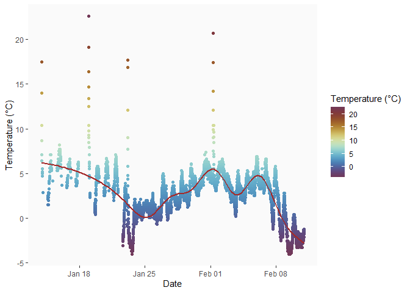

<!-- README.md is generated from README.Rmd. Please edit that file -->

```{r, include = FALSE}
knitr::opts_chunk$set(
  collapse = TRUE,
  comment = "#>",
  fig.path = "man/figures/README-",
  out.width = "100%"
)
```

# audiomoth.tools

<!-- badges: start -->

<!-- badges: end -->

Audiomoth.tools provides functions for working with files generated by [Audiomoths](https://www.openacousticdevices.info/audiomoth)

## Installation

You can install the development version of this package from [GitHub](https://github.com/) with:

``` r
# install.packages("remotes")
remotes::install_github("samherniman/audiomoth.tools")
```

## Example

```{r example}
library(audiomoth.tools)
```

Currently, there are only two useful functions in this package:

Use `extract_header_info` to extract the information contained in the headers of each WAV file. The headers contain the recording date, time, serial number, gain setting, battery state, and temperature. More details and Python code are provided by Open Acoustic Devices [here](https://github.com/OpenAcousticDevices/Application-Notes/blob/master/AudioMoth_Temperature_Measurements.pdf). This function extracts these data from the header of all Audiomoth files in a given directory and returns a dataframe.

```{r extract-header}
extract_header_info(system.file("extdata", package = "audiomoth.tools"), recursive = FALSE)
```

Here's an example of a figure you can make with the temperature.

```{r graph-temp, eval=FALSE, warning=FALSE, message=FALSE}
header_df <- vroom::vroom(system.file("extdata", "header_df.csv", package = "audiomoth.tools"))

library(ggplot2)
library(magrittr)

header_df %>%
  ggplot(data = .)+
  geom_point(aes(x = recorded_date_time, y = tempeature_celcius, color = tempeature_celcius))+
  geom_smooth(
    aes(x = recorded_date_time, y = tempeature_celcius),
    method = 'gam',
    se = FALSE,
    color = "brown"
    )+
  scico::scale_color_scico("Temperature (°C)", palette = "romaO", direction = -1) +
  labs(y = "Temperature (°C)", x = "Date") +
  theme(
    panel.background = element_rect(fill = "grey98"),
    panel.grid.major = element_blank(),
    panel.grid.minor = element_blank())
```



Depending on your version of the audiomoth software, filenames may look like `20210201_210100T.WAV` (YYYYMMDD_HHMMSST). If you want to upload these files to [Arbimon](https://arbimon.rfcx.org/), you may have to remove the *T* at the end of each filename. You can use `rename_audiomoth_files` to do this.

```{r cars}
rename_audiomoth_files(system.file("extdata", package = "audiomoth.tools"))
```
